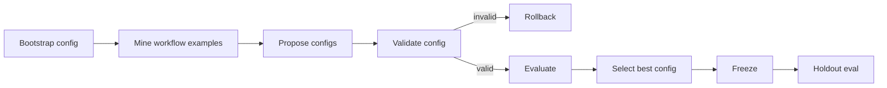

# Research Stem Agent

A small stem-agent experiment for the JetBrains AI Engineering Intern task.

The agent begins as a generic local researcher, studies workflow examples, changes a typed architecture config, evaluates candidate configs, and freezes the best one. The implementation keeps the runtime fixed; adaptation happens through validated configuration rather than code rewriting.

## Scope

The domain is deep research over practical agent-system failures: context drift, noisy retrieval, broken tool calls, memory degradation, citation errors, and evaluation mismatch. The corpus is intentionally small and local so the full experiment is inspectable.

## Architecture



The main contract is `AgentArchitectureConfig`, which controls tools, retrieval, memory, planning, and evaluation metrics. The orchestrator is an explicit state machine rather than a multi-agent setup.

## Run

```bash
python -m pip install -e .
python -m research_stem eval --mode baseline
python -m research_stem evolve --domain data/domains/research_agent_failures.yaml
python -m research_stem eval --mode frozen
```

The project also runs in mock mode without network access. API mode is enabled with `RESEARCH_STEM_LLM=api` and an OpenAI-compatible chat completions endpoint.

## What Changes

Baseline:

- shallow keyword retrieval
- direct synthesis
- no durable memory
- no citation verifier
- no retry budget

Frozen specialist:

- query expansion from mined workflow lessons
- source-diverse retrieval
- citation verification
- bounded source-grounded notes
- evidence-first synthesis
- contradiction checks
- bounded tool retries

## Evaluation

Tasks live in `data/eval/research_tasks.jsonl`. Metrics are deterministic:

- `evidence_recall`
- `citation_precision`
- `unsupported_claim_rate`
- `contradiction_handling`
- `rubric_score`
- `tool_failure_recovery`

The aggregate score is not an LLM judge. The aim is to measure research behavior that fluency can hide.

## Latest API-backed Run

Artifacts are in `artifacts_api_final/`.

| Mode | Score | Evidence recall | Unsupported claim rate | Contradiction handling |
| --- | ---: | ---: | ---: | ---: |
| Baseline | 0.5725 | 0.3125 | 0.7500 | 0.7500 |
| Frozen specialist | 0.9051 | 0.8334 | 0.0000 | 1.0000 |

The frozen agent is slightly slower on this tiny corpus because it retrieves more evidence, writes notes, and verifies citations.

## Failure Modes Covered

- Context drift: baseline synthesis mixes evidence and conclusions.
- Noisy retrieval: shallow top-k misses supporting evidence.
- Broken tool calls: validation includes a simulated transient corpus timeout.
- Memory degradation: notes are source-grounded and bounded.
- Evaluation mismatch: holdout includes fluent-answer risk against citation-level metrics.
- Unsafe adaptation: an invalid config candidate is rejected and logged.

## Layout

- `research_stem/`: runtime, models, agent, evaluation, evolution, CLI
- `configs/baseline.json`: starting architecture
- `data/`: corpus, workflow examples, eval tasks, domain spec
- `docs/writeup_outline.md`: write-up structure
- `artifacts_api_final/`: final API-backed experiment artifacts
- `tests/`: standard-library tests
